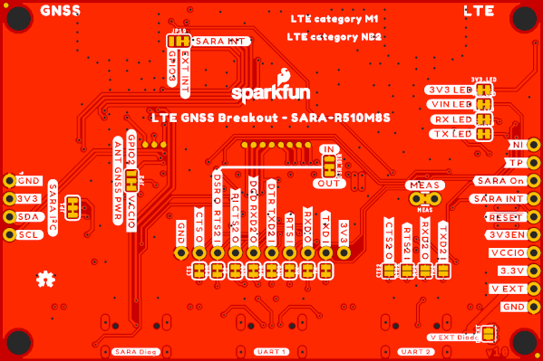
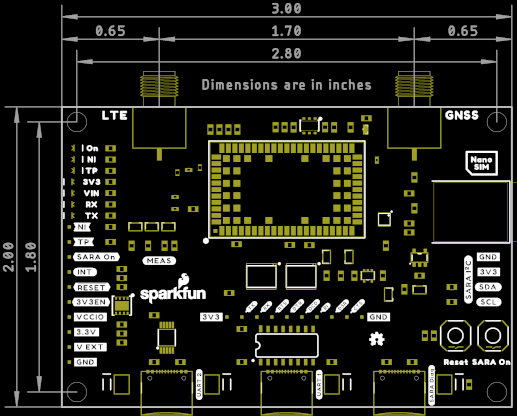

# u-blox SARA-R510M8S Breakout

A breakout for the u-blox SARA-R510M8S cellular LTE GNSS combo module with secure cloud.

The u-blox SARA-R510M8S module is a secure cloud LTE Cat M1, LTE Cat NB2 solution based on u-blox's UBX-R5 cellular chipset.
The SARA-R510M8S has an integrated u-blox M8 GNSS receiver chip and a separate GNSS antenna interface.

The SARA-R5's UART interface can be configured into one of five variants, providing connectivity over one or two UARTs. A separate USB port
provides access to the SARA's trace log for diagnostic purposes. This breakout provides access to all three interfaces (UART1, UART2 and SARA Diag)
via three separate USB-C connections. All eight 3.3V serial signals are available on a 0.1"-pitch breakout header.

## UART 1 & 2

The board comes pre-configured to support interface variants 0 and 1 (single UART, 8-wire connectivity). If you want to use variants 2-4 (dual UART),
you will need to:
- Open the split pads adjacent to the **DTR**, **DCD**, **RI** and **DSR** breakout pins
- Close the solder split pads labelled **TXD2**, **RXD2**, **RTS2** and **CTS2**
- Open the **OUT** split pad labelled **DSR O RTS2 I** and close the adjacent **IN** solder split pad

The serial signals on the breakout pins are all 3.3V. Level-shifting circuits connect them to the SARA's 1.8V UART pins.

## Power Options

The board can draw 5V power from any or all of the USB-C connectors. Optionally, you can provide power via the **V EXT** breakout pin: 3.7V Min; 6.0V Max.

If you want to use **V EXT** as an output, you can bypass the DVEXT protection diode by closing the **V EXT Diode** solder split pad.

The board's 3.3V current draw can be monitored via the **MEAS** header pins. Open the split pad linking these pins if required.

## Additional Breakout Pins

- **NI** - Network Indicator will be _low_ when the SARA is on and the network is available.
- **TP** - GNSS Timing Pulse (PPS) pin will pulse low/high when configured by the **+UTIME=1,1** command. Please see the [AT Commands Manual](./Documents/SARA-R5_ATCommands_(UBX-19047455).pdf) for more details.
- **SARA On** - pull low for 5 seconds then release to turn the SARA off. Pull low briefly again to turn the SARA back on. You can tell if the SARA is powered by monitoring the **VCCIO** 1.8V pin.
- **INT** - by default this pin is connected to the SARA's bi-directional **EXT INT** pin. It can optionally be connected to **GPIO3** by reconfiguring the **SARA INT** split pad.
- **~RESET** - pull low and release to reset the SARA.
- **SARA I2C** - provides access to the SARA's I2C SDA and SCL pins.
- **3V3EN** - pull this pin low to disable the 3.3V supply completely. _Note: you may want to turn the SARA off using the **SARA On** pin first, so it disconnects from the network correctly._

**NI**, **TP**, **SARA On**, **INT**, **~RESET**, **SDA** and **SCL** are all 3.3V. Level-shifting circuits connect them to the SARA's 1.8V I/O pins.

_**Important Note**: **VCCIO** is 1.8V. You may need to connect it to an analog input to sense the voltage correctly._

_**Important Note**: **3V3EN** is pulled-up to VIN (5V) via a 100K resistor. We recommend using a switch or open-collector / open-drain output to pull **3V3EN** low._

## Switches

- **Reset** - pressing this switch will reset the SARA.
- **SARA On** - pressing and holding this switch for five seconds will turn the SARA off. Press briefly to turn the SARA back on again.

## GNSS Antenna Power

The board provides 3.3V power for an active GNSS antenna. By default the antenna power is enabled whenever the SARA is on. You can reconfigure the **ANT GNSS PWR**
split pad to optionally control the antenna power via the SARA's GPIO2 pin.

The GPIO2 pin can be controlled using the **+UGPIOC=23,0,1** command.
Please see the [AT Commands Manual](./Documents/SARA-R5_ATCommands_(UBX-19047455).pdf) for more details.

## Repository Contents

- **/Documentation** - Datasheets etc.
- **/Hardware** - Eagle PCB, SCH and LBR design files. Full schematic in PDF format.
- **[LICENSE.md](./LICENSE.md)** - License details

## Arduino Library

- [SparkFun u-blox SARA-R5 Arduino Library](https://github.com/sparkfun/SparkFun_u-blox_SARA-R5_Arduino_Library)
